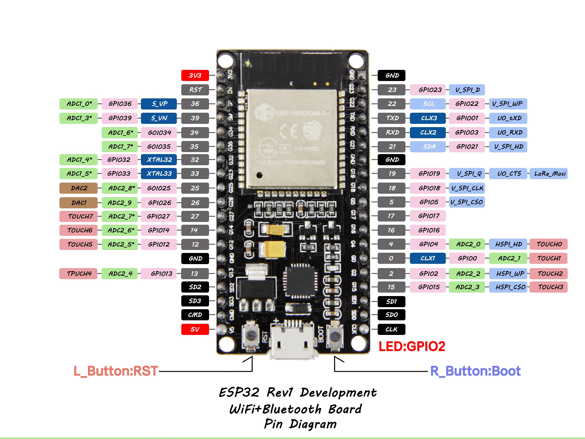

Drivers for ESP-32: https://www.silabs.com/products/development-tools/software/usb-to-uart-bridge-vcp-drivers

Libraries used in ESP 32:
https://github.com/knolleary/pubsubclient
https://github.com/evert-arias/EasyButton

TODO:
* continuous integration

feature ideas: 
* undoing points
* multiple game modes (like 2/5 serves per player, 11/21 points to win etc.)
* led indicator to indicate wifi+mqtt connection
* game duration timer
* integrating to the original wunderpong app
* starting game with the face recognition webcam (to get the names of the players)
* saving games to the wunderpong score board

nice-to-have:
* wireless buttons (for example 433 mhz)

To start MQTT broker for local development, run: 

`docker run -it -p 1883:1883 -v mosquitto:/mosquitto/config eclipse-mosquitto`

https://www.aliexpress.com/item/ESP32-Development-Board-WiFi-Bluetooth-Ultra-Low-Power-Consumption-Dual-Cores-ESP-32-ESP-32S/32799710563.html?spm=a2g0s.9042311.0.0.27424c4d0UfrTN

